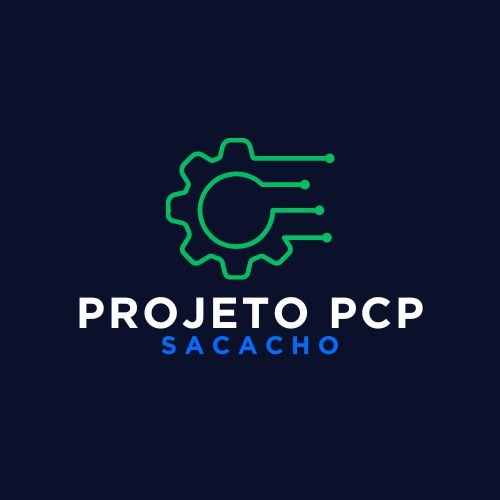
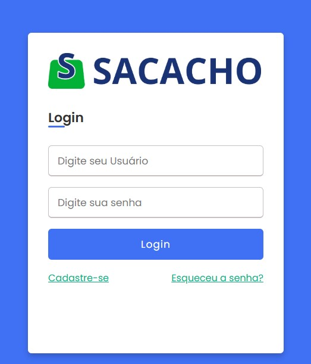
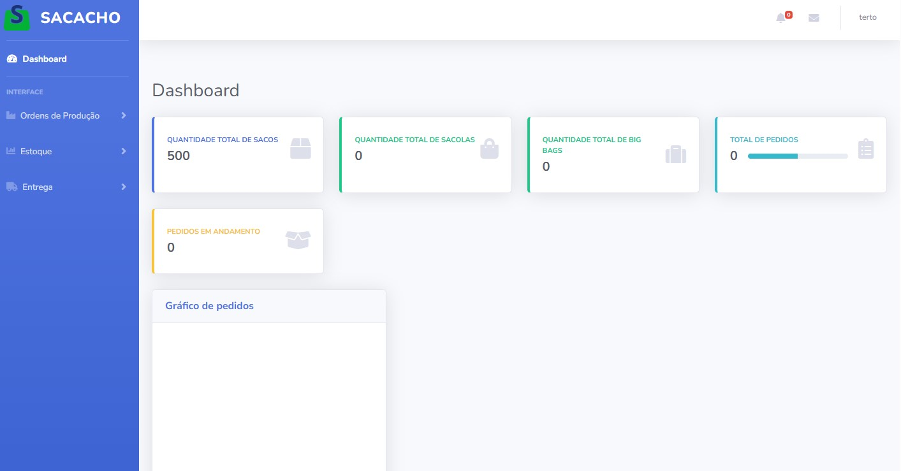
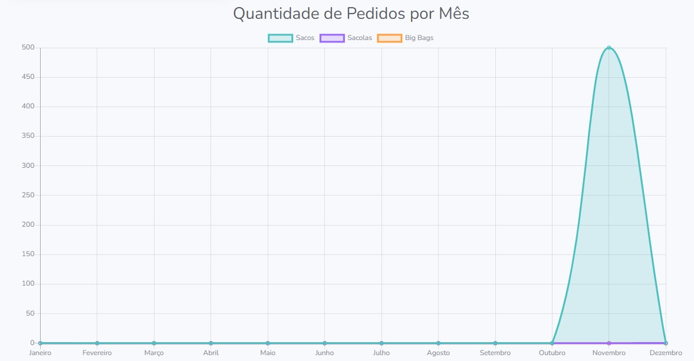
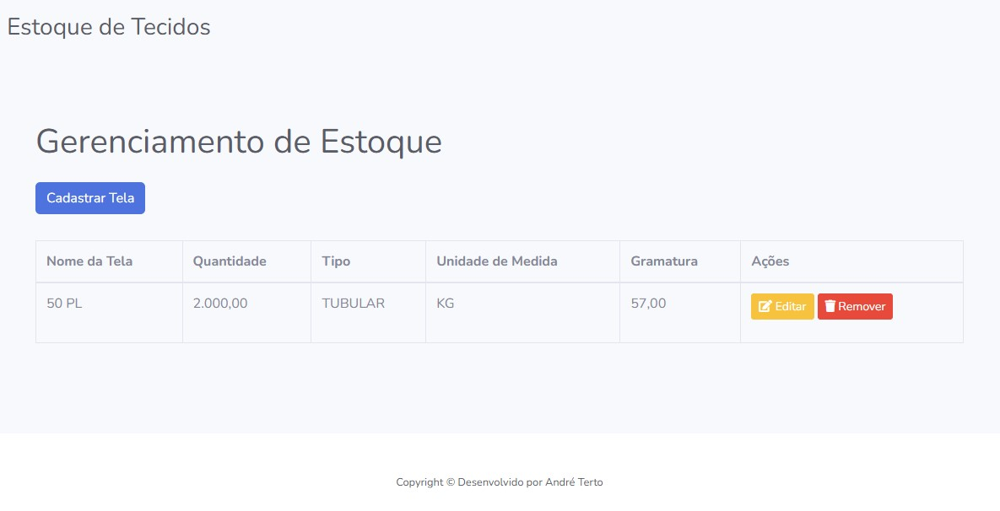
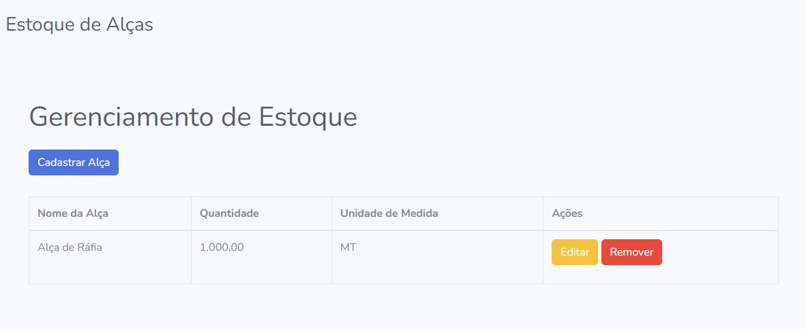
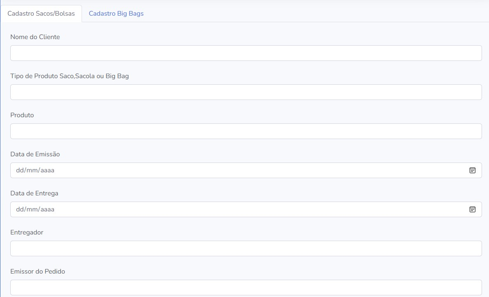
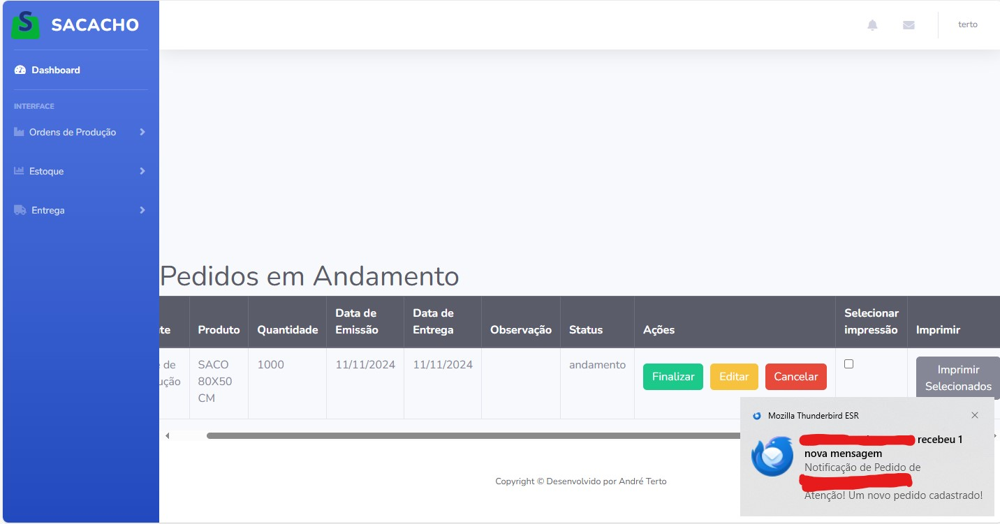
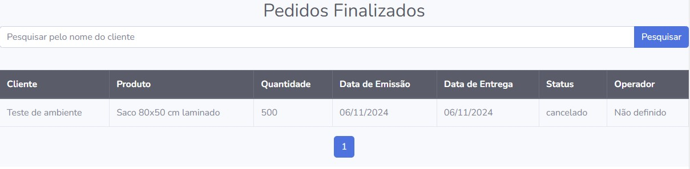

<!-- Improved compatibility of back to top link: See: https://github.com/othneildrew/Best-README-Template/pull/73 -->
<a id="readme-top"></a>


<!-- PROJECT SHIELDS -->

[![Contributors][contributors-shield]][contributors-url]
[![LinkedIn][linkedin-shield]][linkedin-url]


<!-- PROJECT LOGO -->
<br />
<div align="center">
  <a href="https://github.com/AndreTerto598/PCP">
    
  </a>

  <h3 align="center">PCP Sacacho</h3>

  <p align="center">
    Projeto de aplicativo Web para Planejamento e controle de Produção.
    <br />
    <a href="https://github.com/AndreTerto598/PCP"><strong>Veja a documentação. »</strong></a>
    <br />
    <br />
    ·
    <a href="https://github.com/AndreTerto598/PCP/issues/new?labels=bug&template=bug-report---.md">Reporte um Bug</a>
    ·
    <a href="https://github.com/AndreTerto598/PCP/issues/new?labels=enhancement&template=feature-request---.md">Sugira melhorias</a>
  </p>
</div>


<!-- TABLE OF CONTENTS -->
<details>
  <summary>Índice</summary>
  <ol>
    <li>
      <a href="#sobre-o-projeto">Sobre o Projeto</a>
      <ul>
        <li><a href="#linguagens-utilizadas">Linguagens utilizadas</a></li>
      </ul>
    </li>
    <li>
      <a href="#comece-por-aqui">Comece por aqui.</a>
      <ul>
        <li><a href="#pré-requisitos">Pré-Requisitos</a></li>
        <li><a href="#instalação">Instalação</a></li>
      </ul>
    </li>
    <li><a href="#casos-de-uso">Casos de uso</a></li>
    <li><a href="#roadmap">Roadmap</a></li>
    <li><a href="#licença">Licença</a></li>
    <li><a href="#contato">Contato</a></li>
  </ol>
</details>


<!-- Sobre o Projeto -->
## Sobre o Projeto


Com a emergente necessidade de automatizar o setor de produção da empresa e dificuldades em achar um software PCP para confecção têxtil que nos atendesse, resolvi criar um software PcP personalizado que atenda as necessidades da empresa.

O que ele engloba:
* Cadastro de usuários e autenticação.
* Estoque funcional de matéria prima.
* Criação, produção e finalização de pedidos.
* Planejamento de Entregas

O Objetivo do projeto é minimizar a quantidade de erros humanos no processo de produção, automatizando ao máximo os setores e funções. O projeto conta com um processo de produção em 3 etapas simples, e que, ao ser finalizado, automaticamente realiza o desconto dos insumos do estoque, fornecendo ao usuário uma visualização em tempo real do seu estoque.


<p align="right">(<a href="#readme-top">back to top</a>)</p>


### Linguagens utilizadas

Lista de linguagens utilizadas no projeto:

* ![JavaScript][JavaScript]
* ![Python][Python]
* ![Flask][Flask]
* ![Jinja][Jinja]
* ![HTML5][HTML5]
* ![CSS3][CSS3]
* ![Bootstrap.com][Bootstrap.com]

<p align="right">(<a href="#readme-top">back to top</a>)</p>


<!-- GETTING STARTED -->
## Comece por aqui

Este é um projeto personalizado para a empresa Sacacho. Para adquirir um Projeto personalizado para sua empresa, entre em contato por um dos canais de contato.

### Pré Requisitos

O projeto é bem leve e roda em seu navegador.

### Instalação


1. Entre em contato para adquirir uma licença através dos canais de contato 
2. Baixe o repositório zipado ou Clone.
   ```sh
   git clone https://github.com/AndreTerto598/PCP.git
   ```
3. Faça as modificações necessárias, Conforme sua infraestrutura.
   

<!-- Casos de uso -->
## Casos de Uso

Use esta seção para aprender sobre a utilização do aplicativo e como ele funciona.

### Cadastro

O projeto conta com uma página de cadastro para novos usuários, simples e funcional, basta apenas preencher com os dados requisitados.


### Login

Após realizar seu cadastro, o usuário deverá fazer login com as credenciais cadastradas.



### Página Principal

A primeira parte da página principal contém as informações dos produtos fabricados, pedidos em andamento e a barra lateral de navegação para outras sessões.



Logo abaixo tem um gráfico interativo com as produções mensais de cada categoria de produto.



### Estoque de Tecido

Na página de estoque de tecido é possível cadastrar,editar e remover os tecidos e insumos que serão utilizados nas ordens de produção. É importante que o cadastro seja feito corretamente para que o sistema possa calcular o gasto destes insumos.



### Estoque de Alças

Na página de estoque de Alças é possível cadastrar,editar e remover as Alças e insumos que serão utilizados nas ordens de produção. É importante que o cadastro seja feito corretamente para que o sistema possa calcular o gasto destes insumos.



### Cadastro de Ordem de Produção

A página de cadastro de produção é simples e intuitiva. O usuário deve apenas cadastrar a OP com as informações corretas e necessárias para a produção.Ao cadastrar um novo pedido, chegará uma mensagem de notificação por e-mail para o setor de expedição.




### Op´s em andamento

A página de Op´s em andamento retorna para o usuário uma visualização limpa com todas as informações necessárias para localizar o pedido, além disso, também conta com os botões de "Cancelar" caso o pedido necessite ser cancelado, "Editar", caso haja mudança no pedido e "Finalizar", Para atualizar o status do pedido. O Botão de finalizar, quando acionado, é o responsável pela lógica de descontos dos insumos.




### Op´s Finalizadas

A página de Op´s Finalizadas, retorna todas as Op´s finalizadas anteriormente, em ordem decrescente, da mais recente a mais antiga, além disso, há um campo de busca, para facilitar a pesquisa por Op´s específicas.



<p align="right">(<a href="#readme-top">back to top</a>)</p>


<!-- ROADMAP -->
## Roadmap

- [x] Cadastro de Usuários
- [X] Login e autenticação
- [X] Estoques
- [X] Ordens de Produção
- [X] Dashboard
- [X] Entrega


<p align="right">(<a href="#readme-top">back to top</a>)</p>


<!-- CONTRIBUTING -->
## Contribuição

Caso deseje contribuir com este jovem analista e programador, você pode me seguir nas redes sociais e compartilhar meu projeto com outras pessoas.Os links das redes sociais e contatos estão abaixo.


### Autor:

<a href="https://github.com/AndreTerto598/PCP/graphs/contributors">
   

  Sou um jovem de 21 anos apaixonado por tecnologia. Atualmente curso CiberSegurança, mas tenho formação técnica em Desenvolvimento de Sistemas e qualificações em Oracle Banco de dados, entre outras áreas. Altamente Entusiasmado com novos projetos e desafios, gosto de ir além, e penso sempre no que posso agregar e melhorar para o ambiente que estou inserido.Este projeto é uma prova disso e um passo inicial na minha carreira Como Desenvolvedor e Analista.
</a>

<p align="right">(<a href="#readme-top">back to top</a>)</p>


<!-- LICENÇA -->
## Licença

Para Utilização do Projeto, por favor entre em contato comigo por algum dos canais de contato.

<p align="right">(<a href="#readme-top">back to top</a>)</p>


<!-- Contato -->
## Contato

André Terto - Instagram:(@andre_alft2) - E-mail: tertocomercial@gmail.com - Linkedin: https://www.linkedin.com/in/andreterto/

Link do Projeto: https://github.com/AndreTerto598/PCP

<p align="right">(<a href="#readme-top">back to top</a>)</p>


<!-- MARKDOWN LINKS & IMAGES -->
<!-- https://www.markdownguide.org/basic-syntax/#reference-style-links -->
[contributors-shield]: https://img.shields.io/github/contributors/AndreTerto598/PCP.svg?style=for-the-badge
[contributors-url]: https://github.com/AndreTerto598/PCP/graphs/contributors
[issues-shield]: https://img.shields.io/github/issues/othneildrew/Best-README-Template.svg?style=for-the-badge
[issues-url]: https://github.com/othneildrew/Best-README-Template/issues
[license-shield]: https://img.shields.io/github/license/othneildrew/Best-README-Template.svg?style=for-the-badge
[license-url]: https://github.com/othneildrew/Best-README-Template/blob/master/LICENSE.txt
[linkedin-shield]: https://img.shields.io/badge/-LinkedIn-black.svg?style=for-the-badge&logo=linkedin&colorB=555
[linkedin-url]: https://www.linkedin.com/in/andreterto/
[product-screenshot]: images/screenshot.png
[JavaScript]:https://img.shields.io/badge/javascript-%23323330.svg?style=for-the-badge&logo=javascript&logoColor=%23F7DF1E
[Python]: https://img.shields.io/badge/python-3670A0?style=for-the-badge&logo=python&logoColor=ffdd54
[HTML5]:https://img.shields.io/badge/html5-%23E34F26.svg?style=for-the-badge&logo=html5&logoColor=white
[CSS3]:https://img.shields.io/badge/css3-%231572B6.svg?style=for-the-badge&logo=css3&logoColor=white
[Flask]:https://img.shields.io/badge/flask-%23000.svg?style=for-the-badge&logo=flask&logoColor=white
[Jinja]:https://img.shields.io/badge/jinja-white.svg?style=for-the-badge&logo=jinja&logoColor=black
[Bootstrap.com]: https://img.shields.io/badge/Bootstrap-563D7C?style=for-the-badge&logo=bootstrap&logoColor=white
[Bootstrap-url]: https://getbootstrap.com
[JQuery.com]: https://img.shields.io/badge/jQuery-0769AD?style=for-the-badge&logo=jquery&logoColor=white
[JQuery-url]: https://jquery.com 
